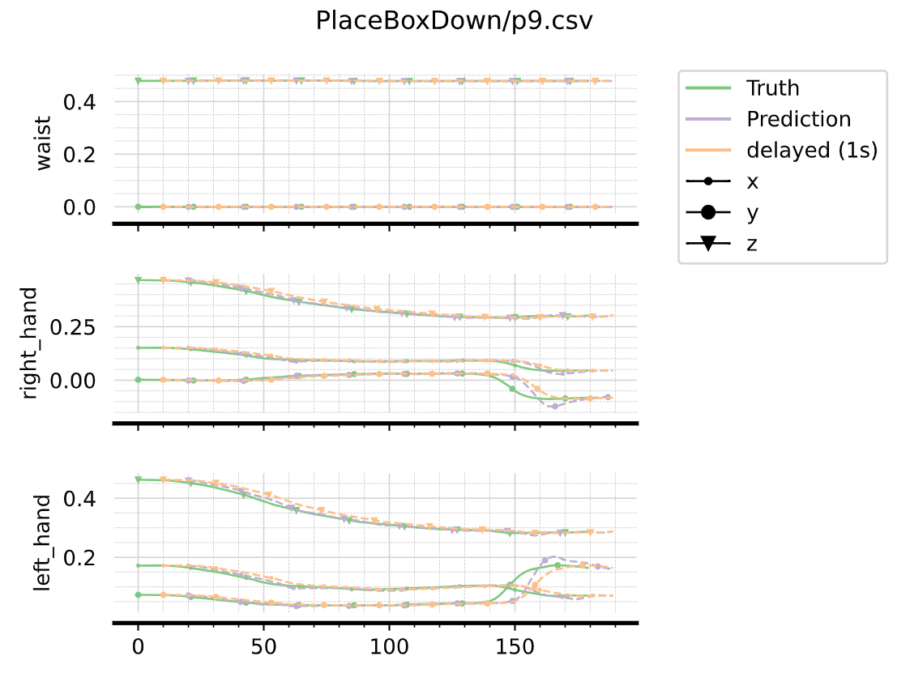

<p align="center">
    
</p>

<h2 style="text-align: center;">
Data-driven trajectory prediction library built in python
</h2>

<p align="center" width="100%">
    
    
</p>

# Get Started
PreScyent is a trajectory forecasting library, built upon pytorch_lightning  
It comes with datasets such as:
- [AndyData-lab-onePersonTeleoperatingICub](https://zenodo.org/record/5913573)  
- [Human3.6M](http://vision.imar.ro/human3.6m/description.php)  

And methods to perform trajectory prediction on this kind of datasets  

## Installation

### From Docker
You can build an image docker from the Dockerfile at the source of the repository.  
Please refer to [docker documentation](https://docs.docker.com) for build command and options.  
The Dockerfile is designed to be run interactively.  

### From source
Clone the repository and cd  

```bash
git clone git@github.com:hucebot/prescyent.git
cd prescyent
```
Then install using pip from source (you may want to be in a [virtualenv](https://python-guide-pt-br.readthedocs.io/fr/latest/dev/virtualenvs.html) beforehand):  
For dev install (recommended if you intent to add new classes to the lib) use:  
```bash
pip install -e .
```
Otherwise simply use:  
```bash
pip install .
```

## Datasets
In this lib, we call "Trajectory" a sequence in time, of n points of m dimensions.  
It is represented with a tensor of shape:  
`(batch_size, sequence_len, num_points, num_dims)`.  
Unbatched tensors are also allowed for inference.  
  
### Downloads
The dataset [AndyData-lab-prescientTeleopICub](https://zenodo.org/record/5913573/) can be downloaded automatically if the files are not found in the given config path.  
  
For [Human3.6M](http://vision.imar.ro/human3.6m/description.php) you need to download the zip [here](http://www.cs.stanford.edu/people/ashesh/h3.6m.zip) and prepare your data following this directory structure:  
```bash
data/datasets (or any custom directory that you specify in the DatasetConfig object)
|-- h36m
|   |-- S1
|   |-- S5
|   |-- S6
|   |-- ...
|   |-- S11
```

## Predictors
The trajectory prediction methods are organized as Predictor classes  
For example, the LinearPredictor class is the implementation of a simple Linear layer as a baseline for the task of Trajectory prediction  
Relying on the PytorchLightning Framework, it instantiates or load an existing torch Module, with a generic predictor wrapper for saving, loading, iterations over a sample and logging.  
Feel free to add some new predictor implementations following the example of this simple class, inheriting at least from the BasePredictor class.  

## Evaluator
We also provide a set of functions to run evaluations and plot some trajectories.  
Runners take a list of predictors, with a list of trajectories and provide an evaluation summary on the following metrics:
- Average Displacement Error (ADE)
- Final Displacement Error (FDE)
- Mean Per Joint Position Error (MPJPE)
- Inference Time

# Usage
Please look into the `examples/` directory to find common usages of the library  
We use tensorboard for training logging, use `tensorboard --logdir {log_path}` to view the training and testing infos (default log_path is `data/models/`)  
For example to run the script for mlp training on teleopIcub dataset use:
```bash
python examples/mlp_icub_train.py
```
If you want to update start a training from a config file (as examples/configs/mlp_h36m.json), use the following:
```bash
python examples/train_from_config.py examples/configs/mlp_h36m.json
```
## Ros2
See [dedicated repository](https://github.com/hucebot/ros2_prescyent/tree/dev)

## Run tests
After installing, run this to make sure the installation is ok  

```bash
python -m unittest -v
```

# Extend the lib with a custom dataset or predictor
Predictors inherit from the BasePredictor class, which define interfaces and core methods to keep consistency between each new implementation.  
Each Predictor defines its PredictorConfig with arguments that will be passed on to the core class, again with a BaseConfig with common attributes that needs to be defined.  
